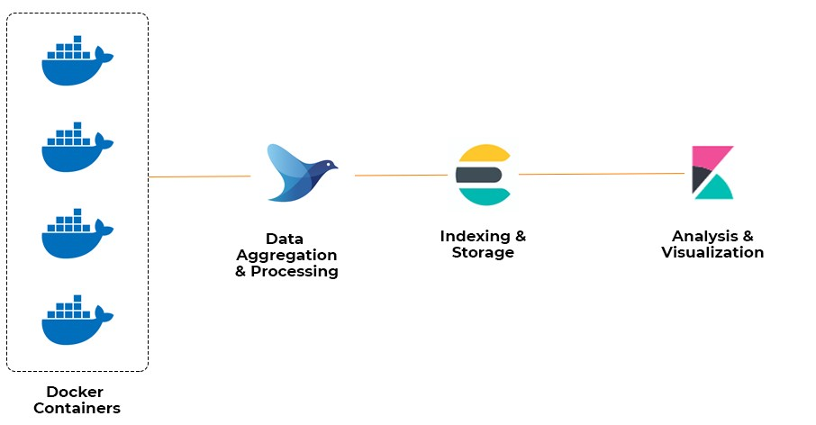
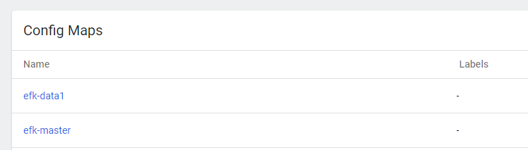
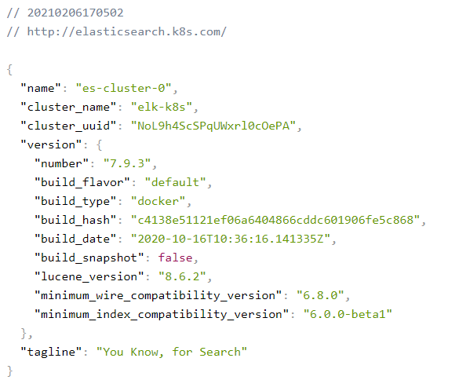
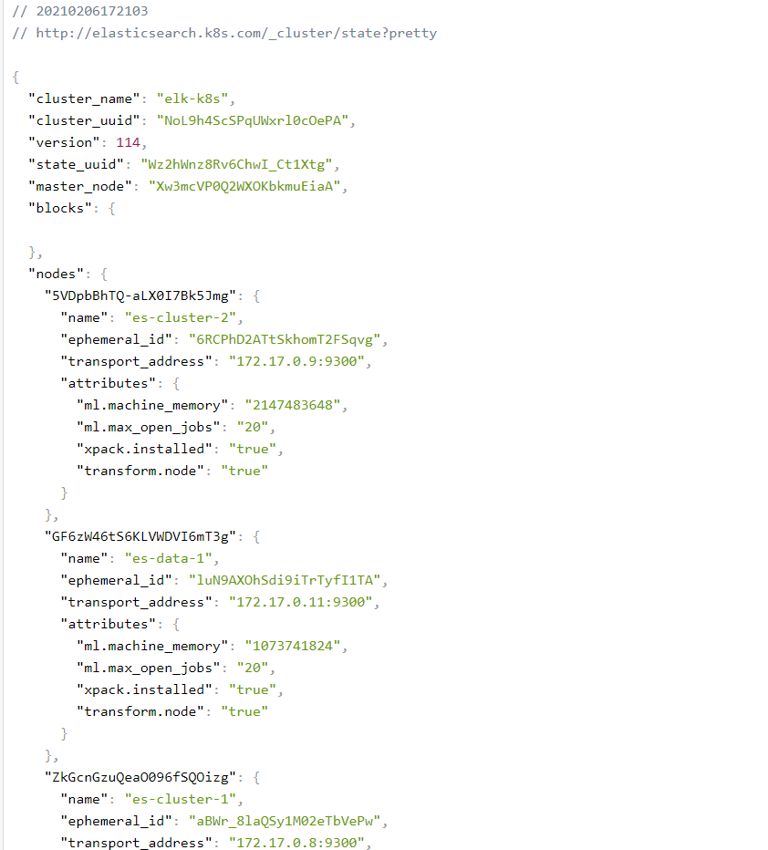
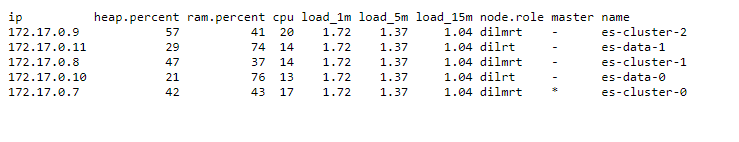
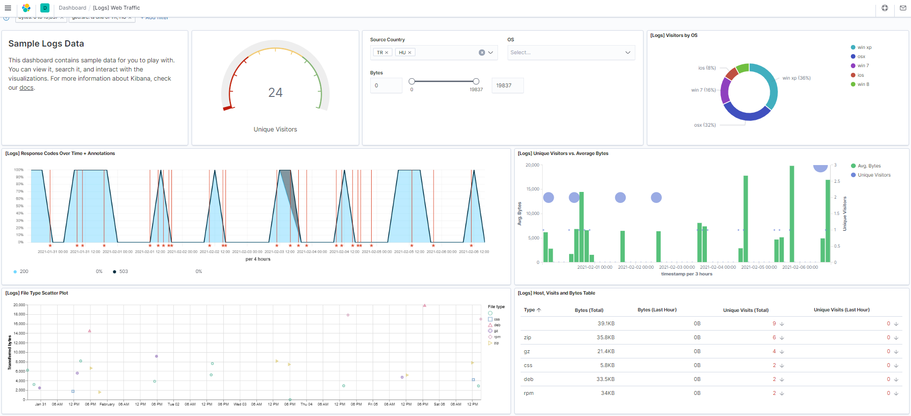
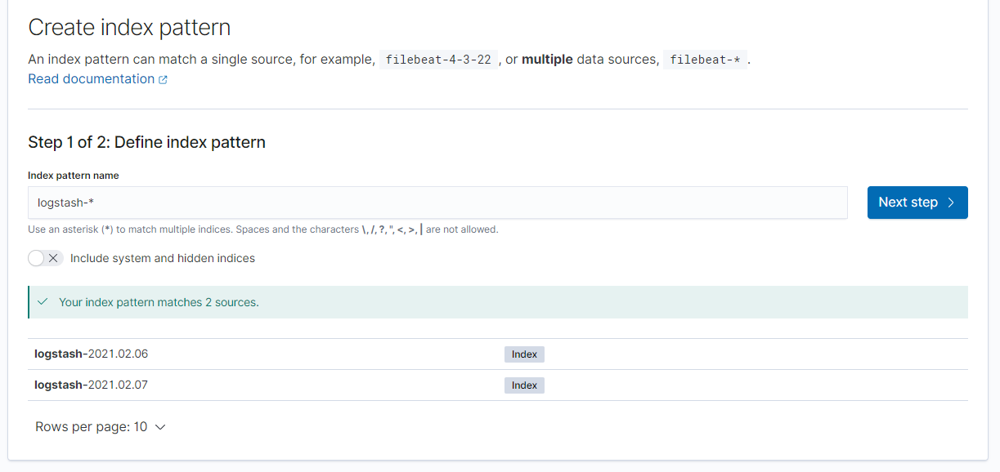
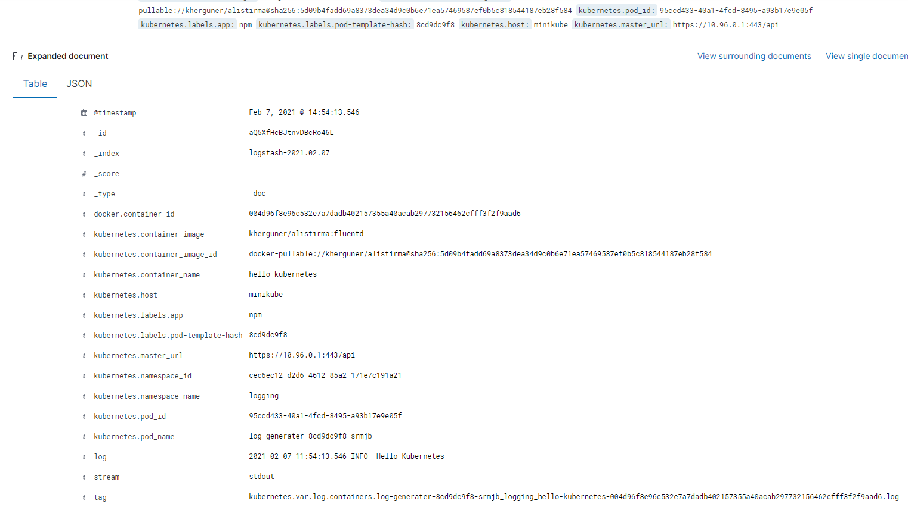
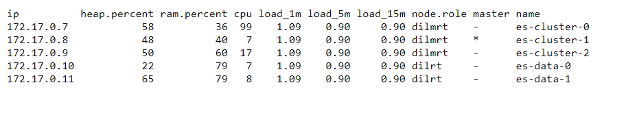

# Scale Elasticsearch, Kibana, Fluentd and NodeJs Project

This project use Elasticsearch, Kibana, Fluentd and Nodejs project, I use the NodeJs project to create logs.



**You have to create dockerfile for NodeJS**

```
git clone https://github.com/khergner/kubernetes-nodejs-logger
```

**First step**

- [x] ConfigMap Deploy

- [x] Elasticsearch Master Deploy

- [x] Elasticsearch Data Node Deploy

- [x] Kibana Deploy

- [x] Fluentd Deploy

- [x] NodeJs Deploy


if you want to create pod, you can use the below command 

>kubectl create -f elasticsearch-configmap.yaml



>kubectl create -felasticsearch-master.yaml

>kubectl create -f elasticsearch-data.yaml

**You can use "http://elasticsearch.k8s.com/"**



**Master and Data node are connected to each other**

Via http://elasticsearch.k8s.com/_cluster/state?pretty



**All nodes resource consumption**

Via http://elasticsearch.k8s.com/_cat/nodes?v



>kubectl create -f kibana.yaml

Kibana is ready to use



>kubectl create -f fluentd.yaml

Fluentd is collecting the logs. After You can select logstash-*, You check Kibana dashboard 



>kubectl create -f node-deployment.yaml

Appliaction is sending "Hello Kubernetes" 



**Test Master Node Selecting**

```
Now master pod is es-cluster-0. Delete the tagged master pod. Cluster re-deploy a new one instead of the deleted pod. So New master node es-cluset-1.
http://elasticsearch.k8s.com/_cat/nodes?v 
```


You can see dashboard via browser @octocat :+1: